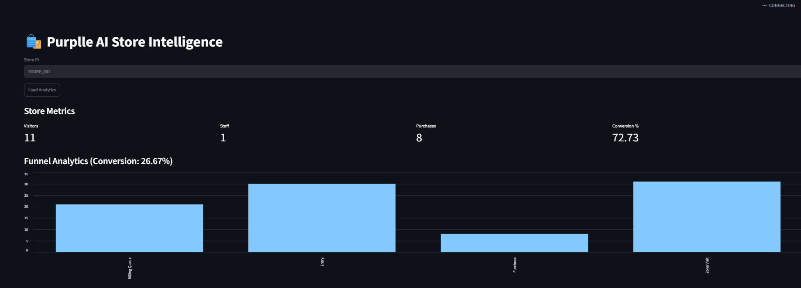
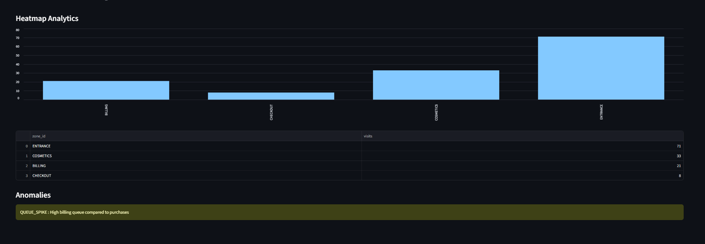
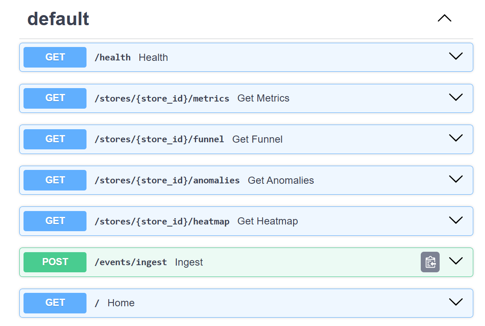

# Purplle AI Store Intelligence

AI-powered Store Intelligence System built for the Purplle Tech Challenge 2026.

---

## Overview

Purplle AI Store Intelligence converts CCTV footage into actionable retail analytics.

The system uses YOLOv8 to detect people from CCTV images, generates structured store events, stores them in SQLite, and exposes business intelligence APIs through FastAPI. Analytics are visualized using a Streamlit dashboard.

The platform helps retail teams understand customer movement, store engagement, conversion performance, and operational anomalies.

---

## Features

### Detection Pipeline

* YOLOv8 Person Detection
* Confidence Scoring
* Visitor Identification
* Simulated Customer Journey Generation

### Event Processing

* FastAPI Event Ingestion API
* UUID-based Event IDs
* Idempotent Event Storage
* Duplicate Event Protection
* SQLite Event Store

### Customer Journey Events

* ENTRY
* ZONE_VISIT
* BILLING_QUEUE
* PURCHASE
* EXIT
* REENTRY

### Analytics

* Unique Visitor Metrics
* Staff-Aware Analytics
* Purchase Tracking
* Conversion Rate Analytics
* Funnel Analytics
* Heatmap Analytics

### Intelligence Features

* Queue Spike Detection
* Dead Zone Detection
* Low Conversion Detection
* No Activity Detection

### Monitoring

* Health Monitoring Endpoint
* Database Connectivity Check
* Event Count Monitoring

### Dashboard

* Visitor Metrics
* Staff Count
* Purchase Metrics
* Conversion Rate
* Funnel Visualization
* Heatmap Visualization
* Anomaly Alerts

---

## System Architecture

CCTV Image / Video

↓

YOLOv8 Person Detection

↓

Event Generation Layer

↓

FastAPI Ingestion API

↓

SQLite Event Store

↓

Analytics Layer

├── Metrics API

├── Funnel API

├── Heatmap API

├── Anomaly API

└── Health API

↓

Streamlit Dashboard

---

## Project Structure

```text
purplle-ai-store-intelligence/

├── app/
│   ├── anomalies.py
│   ├── database.py
│   ├── funnel.py
│   ├── health.py
│   ├── heatmap.py
│   ├── ingestion.py
│   ├── main.py
│   ├── metrics.py
│   └── models.py
│
├── pipeline/
│   ├── detect.py
│   ├── emit.py
│   ├── run.py
│   └── tracker.py
│
├── data/
│   ├── Images/
│   ├── sample_events.json
│   └── store.db
│
├── docs/
│   ├── DESIGN.md
│   ├── CHOICES.md
│   └── screenshots/
│
├── tests/
│   ├── test_anomalies.py
│   ├── test_funnel.py
│   ├── test_health.py
│   ├── test_metrics.py
│   └── test_pipeline.py
│
├── requirements.txt
└── README.md
```

---

## API Endpoints

### Health Monitoring

```http
GET /health
```

Returns:

* System Status
* Database Connectivity
* Total Events Stored

---

### Event Ingestion

```http
POST /events/ingest
```

Stores incoming retail events.

---

### Store Metrics

```http
GET /stores/{store_id}/metrics
```

Returns:

* Unique Visitors
* Staff Count
* Purchase Count
* Conversion Rate

---

### Funnel Analytics

```http
GET /stores/{store_id}/funnel
```

Returns:

* Entry Count
* Zone Visits
* Billing Queue Visits
* Purchases
* Funnel Conversion Rate

---

### Heatmap Analytics

```http
GET /stores/{store_id}/heatmap
```

Returns:

* Zone-wise Traffic Distribution
* Visit Counts

---

### Anomaly Detection

```http
GET /stores/{store_id}/anomalies
```

Detects:

* NO_ACTIVITY
* LOW_CONVERSION
* QUEUE_SPIKE
* DEAD_ZONE

---

## Screenshots

### Dashboard Overview



### Heatmap & Anomaly Analytics



### Swagger API Documentation



---

## Technology Stack

* Python
* FastAPI
* SQLite
* YOLOv8
* OpenCV
* Pydantic
* Streamlit
* Pytest

---

## Running the Project

### 1. Install Dependencies

```bash
pip install -r requirements.txt
```

---

### 2. Start FastAPI

```bash
uvicorn app.main:app --reload
```

API Documentation:

```text
http://127.0.0.1:8000/docs
```

---

### 3. Run Detection Pipeline

```bash
python pipeline/run.py
```

This will:

* Run YOLOv8 person detection
* Generate customer journey events
* Store events in SQLite
* Populate analytics APIs

---

### 4. Launch Dashboard

```bash
streamlit run dashboard/app.py
```

---

## Testing

Run all tests:

```bash
pytest
```

Current Status:

* Analytics Tests
* Funnel Tests
* Health Endpoint Tests
* Anomaly Detection Tests
* Pipeline Tests

Example:

```text
==============================
5 passed
==============================
```

---

### Validation

The YOLOv8 detection pipeline was validated on multiple retail-style scenes with varying customer densities.

Example Results:

* Test Image 1 → 10 persons detected
* Test Image 2 → 12 persons detected

Detected visitors were automatically converted into customer journey events and ingested into the analytics pipeline.


## Engineering Highlights

* YOLOv8-based visitor detection
* Event-driven architecture
* UUID event generation
* Idempotent event ingestion
* Staff-aware analytics
* Retail funnel analytics
* Heatmap analytics
* Intelligent anomaly detection
* Health monitoring
* Interactive dashboard

---

## Future Improvements

* Multi-object tracking
* Real-time CCTV streaming
* PostgreSQL backend
* Kafka event streaming
* Cross-camera visitor tracking
* Machine Learning-based anomaly detection
* Cloud deployment and monitoring

---

## Author

**Aswini Sudha Kattamuri**

Purplle Tech Challenge 2026 Submission
